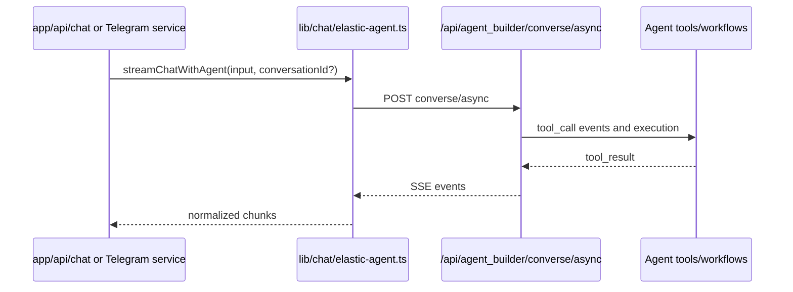

# Elastic Agent Builder Integration

This page describes how the app integrates with Elastic Agent Builder for tool execution, reasoning events, and conversation continuity.

## Responsibility split

- Application (`lib/chat/elastic-agent.ts`) handles API transport, streaming parse, and normalization.
- Agent Builder (Kibana) handles prompt execution, tool calls, workflow invocation, and response generation.
- Elasticsearch tools/workflows provide domain querying and indexing operations.

## Runtime flow

## SSE event normalization (current)

`lib/chat/elastic-agent.ts` maps agent SSE to app-level chunk types:

- `conversation_id_set` -> updates `conversationId`
- `reasoning` -> `reasoning`
- `tool_call` / `call` -> `toolCall`
- `tool_result` -> `toolResult`
- `message_chunk` / `text` / `message` -> `content`
- `round_complete` / `complete` -> `done`
- `error` -> `error`

## Tool and workflow boundaries

Primary references:

- Tool catalog/rationale: [../es-tools/mini-league-agent-tools.md](../es-tools/mini-league-agent-tools.md)
- Workflow assets: [../es-workflows](../es-workflows)
- Prompt policy: [../CHAT-SYSTEM-PROMPT.md](../CHAT-SYSTEM-PROMPT.md)

The current architecture uses:

- Search-oriented tools for flexible lookup paths.
- ES|QL-oriented tools for constrained aggregates/rankings.
- Index remediation workflows for missing data before analytics.

## Conversation continuity

- The API accepts optional `conversationId`.
- The stream updates `conversationId` mid-flight when Agent Builder emits new conversation IDs.
- Web and Telegram both persist and reuse this value for continuation.

## Roadmap (brief)

- Continue reducing schema-field drift between prompt/tool instructions and indexed field names.
- Expand workflow-level guardrails for long-running index flows.
