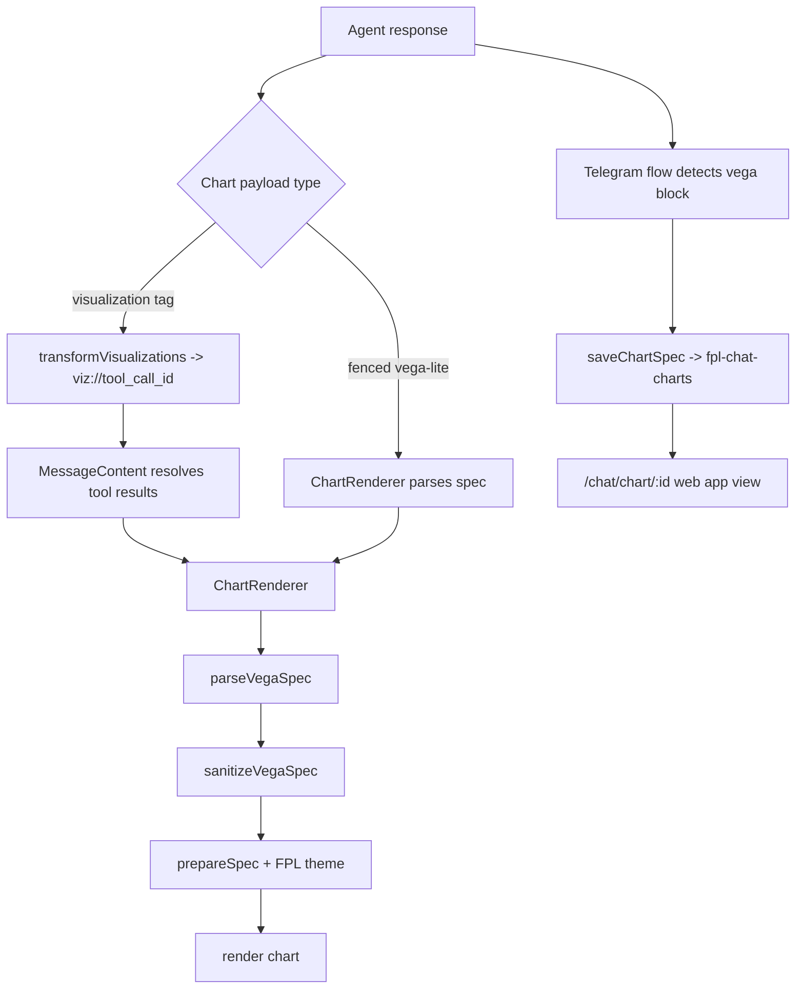

# Charts: Generation, Storage, and Rendering

This page documents the chart path from tool results to UI rendering, including Telegram chart-link storage.

## Chart architecture

## Web rendering path

- Message markdown is processed by `transformVisualizations` to map `<visualization tool-result-id="..."/>` to `viz://...` placeholders.
- `components/chat/MessageContent.tsx` resolves `viz://` IDs using matching `tool_call_id` results.
- `ChartRenderer` parses and sanitizes Vega-Lite specs and applies the FPL chart theme.

## Telegram chart-link path

- `telegram/services/chat-service.ts` inspects final assistant content for fenced Vega blocks.
- On chart detection, it stores spec JSON through `saveChartSpec` in `fpl-chat-charts`.
- Bot message includes an inline web-app button to `/chat/chart/{id}`.
- `app/chat/chart/[id]/page.tsx` loads and renders chart content by stored ID.

## Storage semantics (current)

- Chart IDs are short random IDs (`nanoid`).
- Stored fields: `chart_id`, `spec`, `chat_id`, `expires_at`, `@timestamp`.
- TTL behavior is soft-expiry at read-time (`expires_at` check), currently 7 days from write.

## Security and rendering constraints

- Vega specs are sanitized to remove external URL-based loading.
- Secure loader blocks external network fetches in embedded rendering.
- Theme enforcement keeps visual output aligned with app styling.

## Roadmap (brief)

- Add explicit retention cleanup job for expired chart records.
- Add optional metadata fields for chart provenance/debugging.
