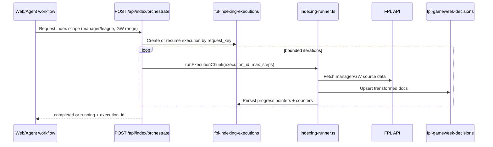
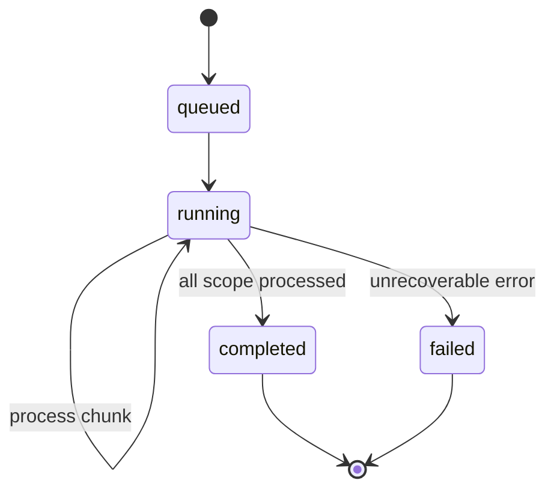

# Elasticsearch & Indexing Architecture

This page documents data storage responsibilities, indexing execution semantics, and API boundaries.

## Elasticsearch indices

| Index | Purpose | Main owner |
| --- | --- | --- |
| `fpl-gameweek-decisions` | Main analytical source for chat queries | `lib/elasticsearch/schema.ts` |
| `fpl-indexing-executions` | Persistent state for async/resumable indexing | `lib/elasticsearch/indexing-executions.ts` |
| `fpl-chat-charts` | Temporary Vega-Lite spec storage for Telegram chart links | `lib/chat/chart-storage.ts` |

## Data model notes (current)

- The primary chat analytics index stores one manager/gameweek decision document.
- Denormalized fields are intentionally included for ES|QL-style aggregation.
- Current normalized result fields include `gw_points`, `gw_rank`, and `total_transfer_cost`.

Reference docs:
- [../../architecture/elasticsearch-denormalization.md](../../architecture/elasticsearch-denormalization.md)
- [../indexing/on-demand-indexing-api.md](../indexing/on-demand-indexing-api.md)

## On-demand indexing flow

## Execution lifecycle

## API contracts

- `POST /api/index/orchestrate`: create/resume + bounded processing loop.
- `POST /api/index/run/{execution_id}`: run next chunk manually.
- `GET /api/index/status/{execution_id}`: progress and terminal state.
- `POST /api/index`: streaming legacy/manual path.

## Roadmap (brief)

- Add periodic cleanup/retention for stale execution and chart records.
- Add stronger auth controls for write/run indexing endpoints.
- Add queue/scheduler-driven chunk execution for less client-driven polling.
