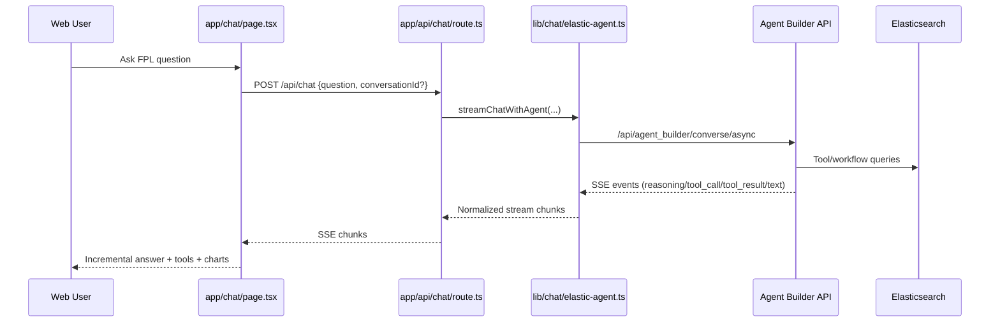
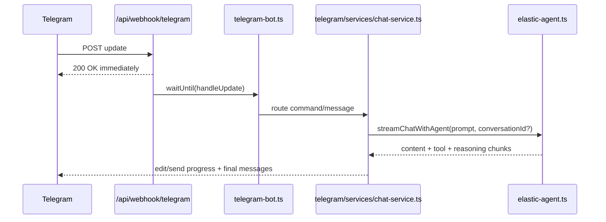

# Chat System Overview

This page describes the end-to-end runtime architecture across Web chat, Telegram, Elastic Agent Builder, and Elasticsearch.

## Component diagram

```mermaid
flowchart TD
    U1[Web User /chat] --> CUI[Chat UI]
    U2[Telegram User] --> TGW[/api/webhook/telegram]

    CUI --> CHAPI[/api/chat SSE]
    CHAPI --> EAC[lib/chat/elastic-agent.ts]

    TGW --> TBOT[lib/chat/telegram-bot.ts]
    TBOT --> TCHAT[telegram/services/chat-service.ts]
    TCHAT --> EAC

    EAC --> KIB[Kibana Agent Builder API]
    KIB --> TOOLS[Agent Tools + Workflows]
    TOOLS --> ESIDX[(fpl-gameweek-decisions)]
    TOOLS --> ESEXE[(fpl-indexing-executions)]

    TCHAT --> CHSTORE[(fpl-chat-charts)]
    TCHAT --> CHARTPAGE[/chat/chart/:id]
```

## Web chat sequence



## Telegram sequence



## Design constraints

- Web chat and Telegram share the same Agent Builder backend and conversation continuation model.
- Indexing is asynchronous and resumable through execution documents in Elasticsearch.
- Chart rendering supports both inline web charts and Telegram chart links via persisted chart specs.
