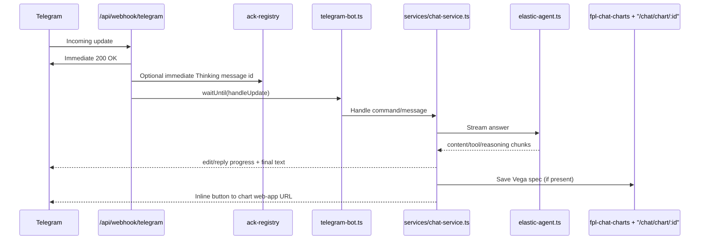

# Telegram Integration Architecture

This page describes the Telegram bot runtime, reliability controls, and chart integration behavior.

## Current integration model

- Webhook endpoint acknowledges quickly and offloads processing in background.
- Bot processes updates with deduplication, per-chat lock, and conversation continuity.
- AI responses stream from the same Agent Builder path used by web chat.
- Charts are provided via Telegram web-app buttons that open stored chart views.

## Runtime sequence

## Reliability controls

- Webhook ACK separation avoids Telegram retry storms for long-running AI work.
- Update dedupe protects against duplicate `update_id` processing.
- Per-chat processing lock avoids concurrent streams in the same chat.
- Conversation store allows reuse/reset of `conversationId` (including expired-session retry).

Primary references:
- `app/api/webhook/telegram/route.ts`
- `lib/chat/telegram-bot.ts`
- `lib/chat/telegram/services/chat-service.ts`
- `docs/architecture/telegram-bot.md`

## Command and message behavior (current)

- Message-first chat is supported.
- `/chat` remains a valid explicit command entrypoint.
- Indexing helper commands are supported via bot command handlers.

## Scope note: Mini App behavior

Current implemented mini-app behavior is chart-focused (web-app chart links from Telegram). Full mini-app chat parity is not yet documented as fully implemented.

## Roadmap (brief)

- Expand mini-app parity beyond chart viewing into richer interactive chat surfaces.
- Keep chart/persona/tone behavior aligned between web and Telegram clients.
